# 📚 Tute.io Enquiry

Tute.io Enquiry is a simple, user-friendly web application built with **PHP** and **MySQL**, designed to help tuition centers efficiently manage and track student enquiries.

Whether you're running a small coaching institute or a large tutoring organization, this system helps you:

- Record new enquiries
- View and manage follow-ups
- Categorize students by course or interest
- Improve response times and record-keeping

---

## 🖼️ Screenshots

### Registartion Page

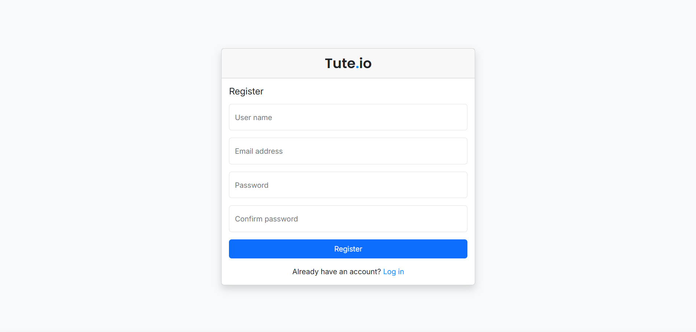

### Login Page

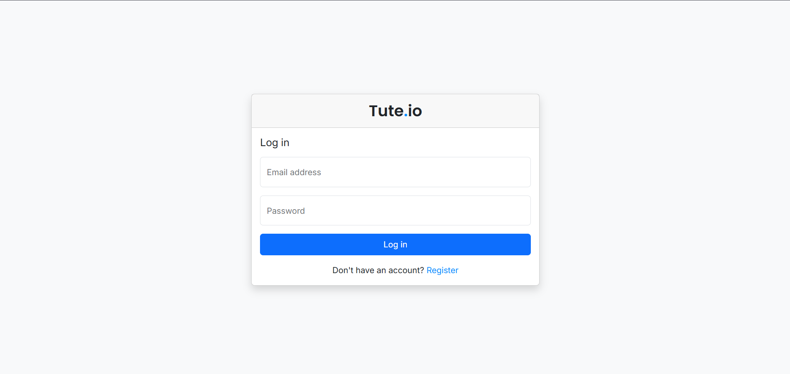

### User Profile Page

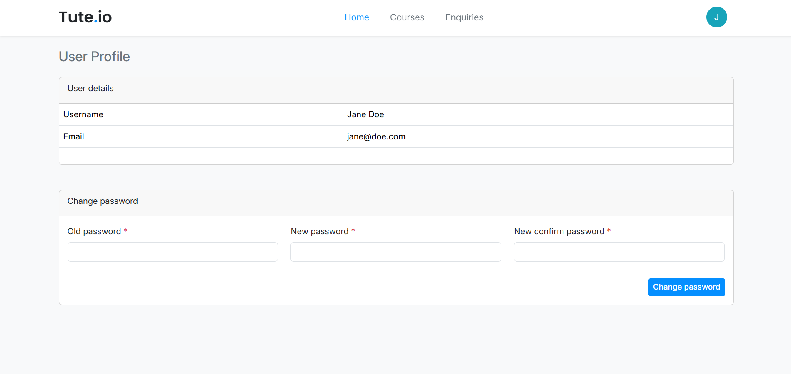

### Home Page

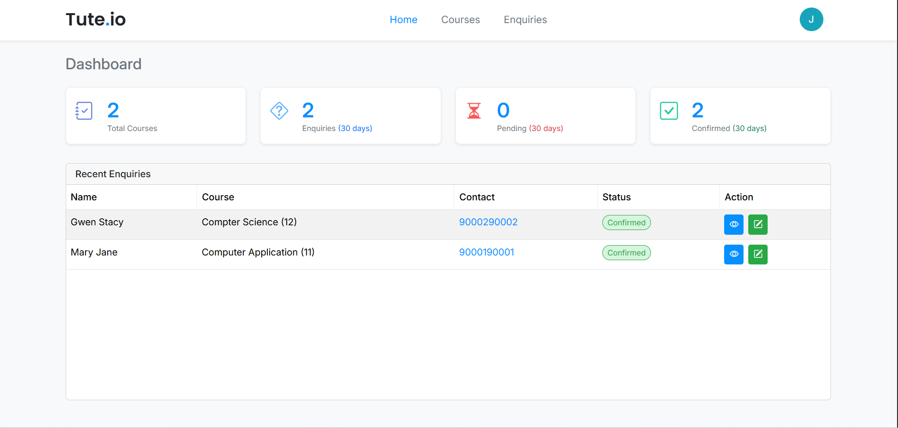

### Course Page

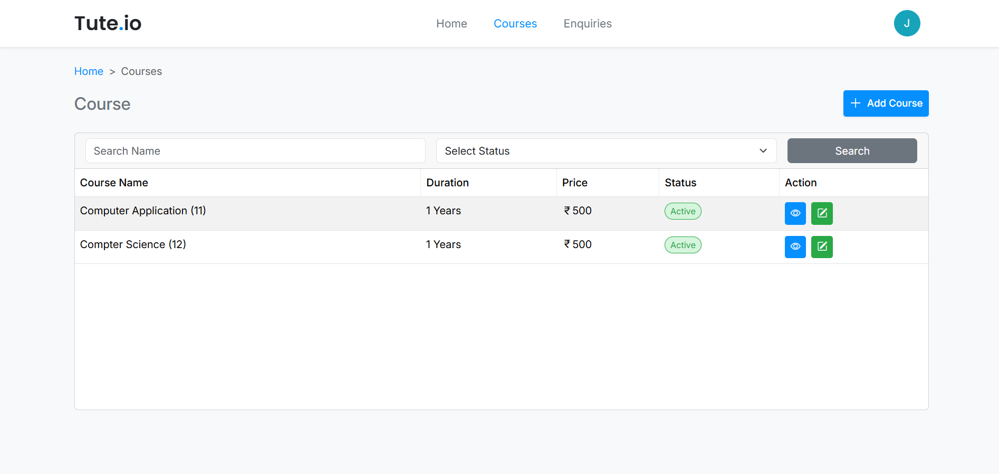

### Add Course Page

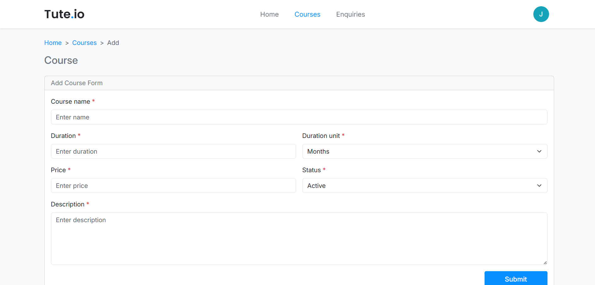

### View Course Page

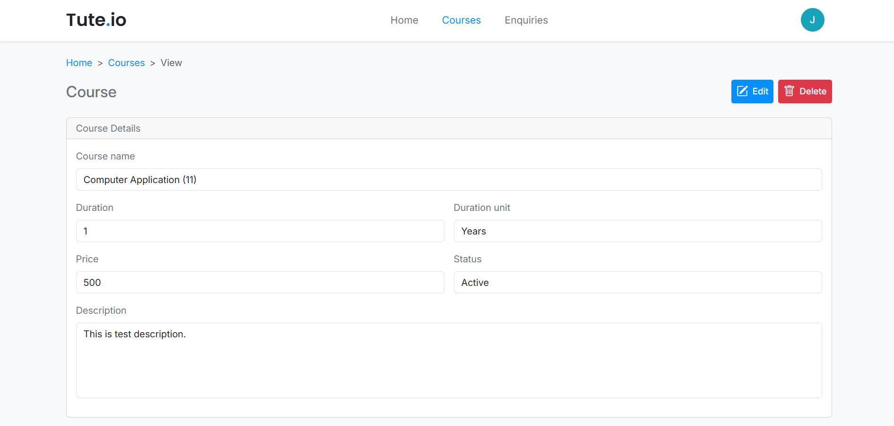

### Edit Course Page

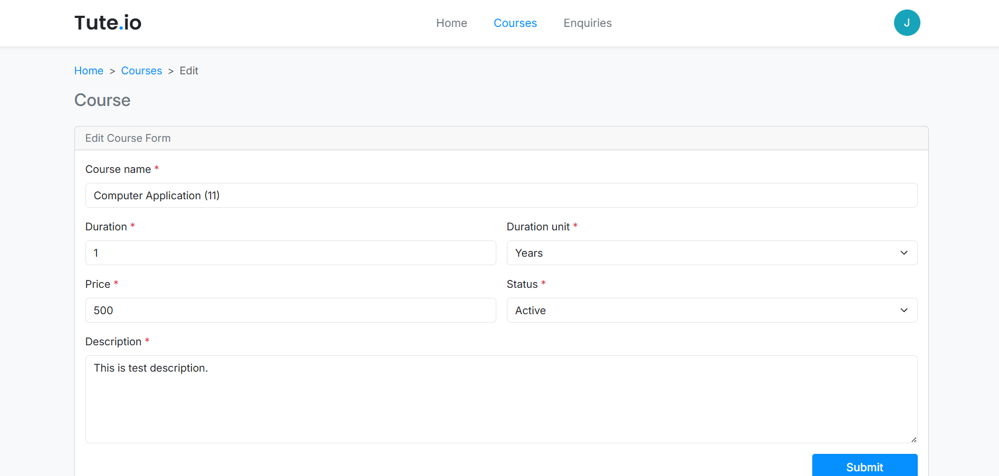

### Enquiry Page

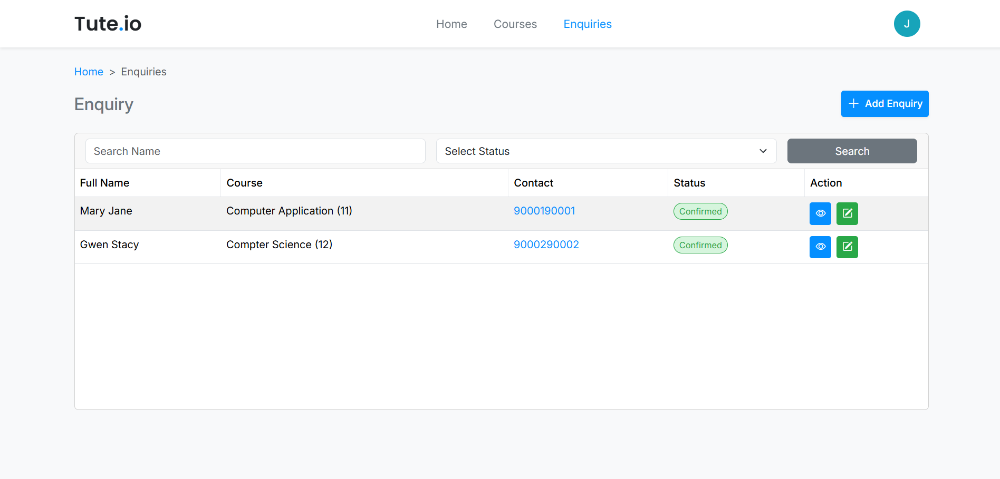

### Add Enquiry Page

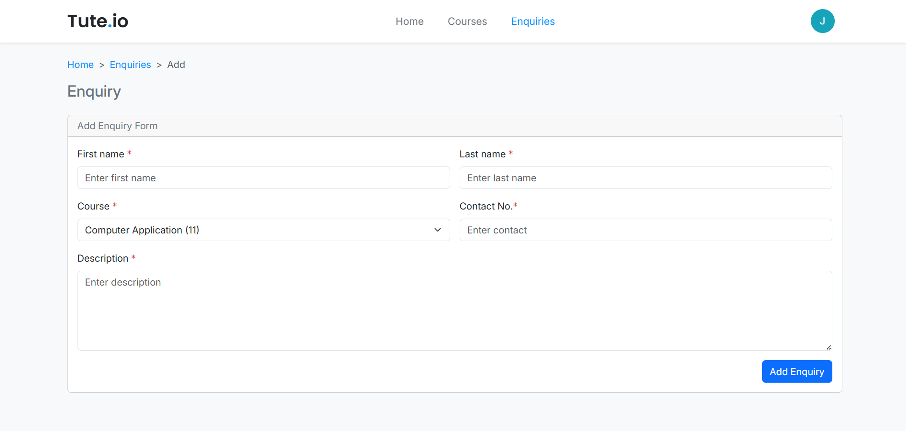

### View Enquiry Page

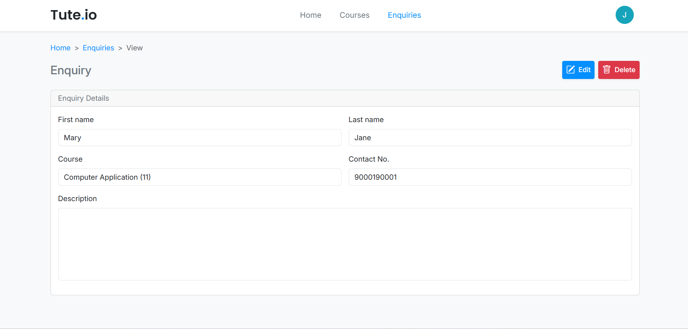

### Edit Enquiry Page

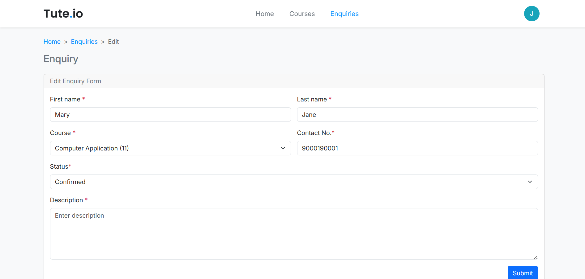

---

## 🎥 Demo Video

Watch the demo of Tute.io Enquiry in action:  

---

